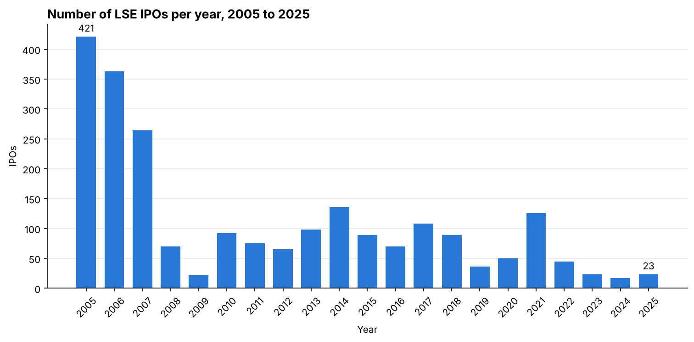
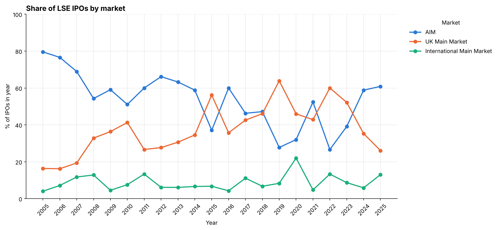

# How has London's IPO market changed since 2005? LSE IPOs, 2005 to 2025

An SQL and Python analysis of 2,282 IPOs on the London Stock Exchange (LSE) from 2005 to 2025: how many there were, which market they listed on, which industries they came from, how big they were and how much new money they raised. The data is cleaned in Excel, validated in Python, loaded into SQLite and queried with SQL from a Jupyter notebook.


## Why this personal project?

I am interested in personal investing, and in the UK stock market in particular. Before looking at individual shares, I wanted to understand the supply of new UK-listed companies: how many list, on which market, in which industries, how big they are and how much they raise. That tells me what a private investor can realistically find among new listings, and how much of it is small, concentrated or cyclical. It also shows which industries have been bringing companies to market at different points in the cycle, which is a way to learn about industries.

This is background, not a stock-picking signal. The data has no share prices, returns, valuations or trading volumes, so it says nothing about how the companies performed after they listed. Nothing here is investment advice.


## Why 2005 to 2025?

I chose 2005 to 2025 for the  is a 21-year window that covers the pre-crisis boom (2005 to 2007), the financial crisis, the 2010s, the pandemic and the recent slump. 2025 is the last complete year (2026 is excluded because the year is incomplete).

The source file starts in June 1995. 1995 to 2004 is excluded, not unavailable. From 2005 the issue types and industry groups are validated: LSEG uses 13 raw issue types across the whole file (11 from 2005), each maps to exactly one category from 2005 (checked by `load_db.py`), and every listing has an industry group. The earlier years have not been validated in the same way yet, and 437 listings from 1995 to 2004 carry 29 older sector names that are not mapped to an industry group (`CHECK - unmapped`). Extending the window back to 1995 is the first item of future work.


## Headline findings

**London's IPO market is much smaller than it was: 27 IPOs a year in 2022 to 2025, against 349 in 2005 to 2007, and the typical IPO opens at about a third of the 2010s size.**


|                                                       | 2005 to 07 | 2008 to 09 | 2010 to 19 | 2020 to 21 | 2022 to 25 |
| ----------------------------------------------------- | ---------- | ---------- | ---------- | ---------- | ---------- |
| **IPOs a year**                                       | 349        | 46         | 86         | 88         | 27         |
| **Median opening market value (£m)**                  | 31.5       | 39.4       | 66.8       | 89.1       | 20.3*      |
| **AIM (Alternative Investment Market) share of IPOs** | 76%        | 55%        | 53%        | 47%        | 42%        |
| **UK Main Market share**                              | 17%        | 34%        | 39%        | 44%        | 47%        |


*Opening value is missing for 15 of the 108 IPOs in 2022 to 2025, mostly large ones, so the true median is probably £21m to £25m.

1. **Volume collapsed.** 46% of all IPOs since 2005 came in 2005 to 2007. 2024 had 17, the lowest year. 2022 to 2025 runs at 8% to 42% of the IPO rate of any earlier baseline period, so the fall does not depend on which period you compare with.
2. **The typical IPO is smaller.** The median opening value fell from £66.8m in the 2010s to about £20m to £25m, and total new money in 2022 to 2025 (£4.2bn) was about a seventh of 2006 alone (£28.8bn).
3. **AIM gave ground to the Main Market.** AIM's share of IPOs fell from 76% to 42% while the Main Market's rose from 17% to 47%.
4. **The industry mix held; the volume did not.** Financials & Real Estate was 42% of IPOs in both 2005 to 2007 and 2022 to 2025, but that is 147 IPOs a year then and 11 now. Basic Materials rose to 18.5% and Health Care peaked at 10.2% in 2020 to 2021, then fell to 3.7%.


## Significance for UK personal investors

1. **New listings are small:** The typical IPO now opens at about £20m to £25m, against £67m in the 2010s, and roughly 70% open below £50m. Over 2005 to 2025 the median was £29m on AIM and £100m on the UK Main Market.   
  
**Use:** Treat a new UK listing as a small-company investment. Compare its opening value with these figures, and check how much of its stock trades before buying, since thin trading and limited public information are the usual risks at this size.  

2. **A fifth of recent IPOs are funds or other investment vehicles, not operating companies.** 23 of the 108 IPOs in 2022 to 2025 (21%) are in fund or investment-vehicle sectors.   
  
**Use:** Check a listing's FTSE sector first, so you know whether you are looking at a business or a fund.  


**New listings are concentrated, so they are a poor guide to UK industries.** In 2022 to 2025, Financials & Real Estate, Basic Materials and Industrials made up 73% of IPOs, while Technology and Health Care together made up 12 of 108.   
  
**Use:** Use IPOs to see where new money is going, not to learn UK industries. Learn those from the established market.


## Key graphs  



## Data

**Source:** London Stock Exchange "New Issues and IPOs" statistics, downloaded from [LSE reports](https://www.londonstockexchange.com/reports?tab=issuers) on [ADD: download date].

**The LSEG data is not included in this repository**, because I have not confirmed that LSEG permits redistribution. This also applies to the cleaned file derived from it (`new_issues.csv`), so `load_db.py` and the notebook cannot be re-run from a fresh clone. The notebook is saved with its outputs and charts, so the results can be read without re-running it. The cleaning steps are described below.


| File                            | What it is                                                                                                                                           | Rows |
| ------------------------------- | ---------------------------------------------------------------------------------------------------------------------------------------------------- | ---- |
| `sector_map.csv`                | The industry group given to each FTSE sector label in the data (95 labels, plus one for blank sectors)                                               | 96   |
| `manual_sector_review.csv`      | The 107 listings that had no FTSE sector, each with an industry group assigned with AI assistance and checked by me, and the source used as evidence | 107  |
| `results/summary_by_period.csv` | Output: the period table above, with the full set of market and industry shares                                                                      | 5    |
| `results/baseline_check.csv`    | Output: 2022 to 2025 compared with four baseline periods (IPOs, new money and median raise per year)                                                 | 4    |
| `results/size_by_market.csv`    | Output: IPO count and median opening market value by market, for 2005 to 2025 and 2022 to 2025                                                       | 3    |
| `results/group_by_year.csv`     | Output: IPO count by industry group and year (the data behind the heatmap)                                                                           | 10   |


`sector_map.csv` has two columns: `sector_label` (the FTSE sector name exactly as it appears in the data) and `industry_group` (the group it was given). The groups are based on the sector name, so the mapping is a judgement, not an official classification. Two judgement calls: `Support Services` sits in Industrials because both involve logistics-type work, and fund and asset-management sectors sit in Financials & Real Estate because they involve both finance and real estate.

`manual_sector_review.csv` has one row per listing that had no FTSE sector. Its columns:

- `chosen_group`: the industry group assigned.
- `what_it_does`: a one-line description of the company.
- `evidence_url` and `source_type`: where the information came from. 58 rows use the company's own website (or its manager's), 3 use an LSE page, and 46 use other sources such as news and announcement sites, brokers and law-firm pages (one is Wikipedia). The 46 are weaker evidence than a company website.
- `review_note`: the other group considered, filled in for 29 rows where the call was not clear-cut.
- `group_on_other_row`: filled in for 11 rows where the same company appears elsewhere in the data with an FTSE group, used as a cross-check.

Not in the repository (listed in `.gitignore`): `new_issues.csv` (6,251 rows, 22 columns, every LSE new issue from June 1995 to December 2025, after cleaning in Excel), the Excel workbook it was cleaned in, and the generated database `lse.db`.


## AI assistance in the project

I used Claude (Anthropic's AI assistant) in this project, specifically for the following:

- **Labelling the 107 blank-sector listings:** Claude assigned each company an industry group. I told it which sources to use (the company's website, its LSE page or Wikipedia) and I checked every one against its source. The sources and the other group considered are recorded in `manual_sector_review.csv`.
- In `sector_map.csv` : Claude helped me map the 95 sector labels to 9 groups. My instruction was: "match the sector labels to the 9 types". 
- In`load_db.py`**:** This is my first time validating data types and completeness, so I used Claude as a learning tool: to understand what to check and to give feedback on my ideas for how to structure it, for example building each step as a function and adding logs. 
- **Notebook and README** Claude helped revise the notebook and write and edit the README text. The Excel cleaning, the choice of questions and the original SQL queries are original.


## Methods

### 1. Cleaning in Excel

- **Unifying issue types** The raw LSEG issue types (13 across the whole file, 11 from 2005) were mapped onto 4 categories with `XLOOKUP`. For example, `New Company Placing`, `Offer for Subscription - New Company` and `International Offering (GDR)` all become `New admission`. The mapping is validated from 2005 (see Why 2005 to 2025).
- **Assigning broader industry groups to IPOs** Each FTSE sector label in the data (95 distinct labels) was mapped to one of nine broad industry groups, based on the sector name, plus a small `Non-company security` category. The mapping is in `sector_map.csv`.
- **Labelling missing sector data** 107 listings had no FTSE sector. Each was assigned an industry group using a source I specified, with what the company does and the URL recorded in `manual_sector_review.csv` (see How AI was used).
- **Pivot tables descriptive statistics** Cross-checked counts by year, month, market and sector before export.


### 2. Validation and loading: `load_db.py`

The database is built only if every check passes:

- **Shape of the export** All required columns are present, there are exactly 6,251 rows, and no duplicate listings.
- **Excel export artefacts repaired:**
  - 1,786 empty columns are dropped, after confirming they hold no data.
  - Dates are parsed and stored as `yyyy-mm-dd`.
  - In money columns, thousands separators are removed and `-` becomes NULL.
- **Filtering known values only** Market, IPO flag and industry group contain only expected values, so a misspelling cannot silently drop rows from a filter.
- **One category per issue type** Each raw issue type must map to exactly one harmonised category. This catches a lookup applied to the wrong rows.
- **The published lookups match the data** The industry group in the data agrees with `sector_map.csv` for every listing that has a sector label. Every listing in `manual_sector_review.csv` matches one row, carries the group used in the data and has an evidence URL, and every blank-sector listing in the analysis is covered.

It writes to a temporary file and swaps it into place, so a failed run leaves the existing database untouched. A `load_metadata` table records the SHA-256 hash of each source file, so every result can be traced to an exact export.


### 3. Analysis: `SQL.ipynb`

**Population** (2,282 IPOs):

```sql
SELECT *
FROM new_issues
WHERE year >= 2005
  AND lse_ipo = 'IPO'
  AND new_issues_type = 'New admission'
  AND market IN ('UK Main Market', 'International Main Market', 'AIM');
```

- **Why these three markets?** The Specialist Fund Market and the Professional Securities Market are specialist segments rather than the Main Market and AIM. 20 of the 24 Specialist Fund Market listings are in investment-fund sectors. Excluding both removes 38 of 2,320 rows (1.6%) and barely moves the results (AIM's share of 2005 to 2007 IPOs goes from 75% to 76%).
- LSEG's `IPO` flag column, which excludes reverse takeovers, introductions and transfers between markets. `New admission` covers 2,133 new company placings, 135 international GDR offerings and 14 offers for subscription.

**Measures:**

- annual IPO count and new money raised (SQL `GROUP BY`);
- the median raise per IPO and median opening market value (pandas, since SQLite has no median function);
- the share of each year's IPOs by market and by industry group;
- the share of IPOs in fund and investment-vehicle sectors, using the FTSE sector names before and after the 2019 reclassification (`Equity Investment Instruments`, `Nonequity Investment Instruments`, `Open End and Miscellaneous Investment Vehicles`, `Closed End Investments`);
- a coverage check: IPOs per industry group and year, shown as a heatmap, to confirm the grouping is populated in every period (Telecoms and Utilities have many years with no IPOs, so their shares rest on very few listings);
- 2022 to 2025 compared with four earlier periods, because the data starts in the 2005 to 2007 boom, which would overstate the fall if used alone.


## Key limitations

- **Industry groups rely on my labels**
  - 43 of the 108 IPOs in 2022 to 2025 (40%) and 41 of 176 in 2020 to 2021 (23%) had no FTSE sector, so their group was assigned with AI assistance and checked by me. Leaving them out moves 2022 to 2025 industry shares by up to about 2 points. FTSE sector names also changed in 2019, and Financials & Real Estate mixes funds with operating companies (23 of its 45 IPOs in 2022 to 2025 are in fund sectors), so it is not a measure of financial services.
- **Market value is missing for 43 IPOs, mostly large recent ones**
  - 15 are in 2022 to 2025, and 9 of those raised £50m or more. The reported 2022 to 2025 median (£20.3m) and share opening below £50m (78.5%) are therefore probably too low. Allowing for this, the median is £20.6m to £25.2m and the share is 68% to 73%, still far below the 2010s (£66.8m and 44.5%). The value is also measured at the opening price and covers the whole company, not the part a private investor can buy.
- **Only new money is measured** 
  - Money from existing shareholders selling (`money_raised_existing_m`) and the total (`total_raised_m`) are blank for 1,731 of the 2,282 IPOs (76%) in the LSEG data, and for every IPO before 2010. It is not possible to tell whether nothing was sold or it was not recorded. Money raised from new shares (`money_raised_new_m`) is the only one of the three with no blanks, so I used it to keep every year comparable. Where selling-shareholder money is recorded (551 IPOs), it adds £18.7bn to £43.5bn of new money, about 30% of proceeds, so totals understate what IPOs raised. 
- **Recent samples are small**
  - With 108 IPOs in 2022 to 2025, one IPO moves a share by about 1 point, and with 17 IPOs in 2024, by about 6. Telecoms and Utilities had no IPOs in 2022 to 2025.
- **No returns, prices or trading volumes**
  -  The analysis cannot say how listings performed, how easy they were to trade, or which industries or sizes were good investments.
- **Limited data scope** 
  - Dataset cannot show whether London is a leading European listing venue. 
  - It describes what changed, and we cannot infer why from it alone 


## Future research questions

- **Do new listings perform?** Add share-price data to compare returns after listing by market, size and industry. 
- **Who lists in London?** The data includes each company's country of incorporation. Comparing UK and overseas issuers over time would show how international London's IPO market is. It is a crude proxy, though: many overseas issuers are holding companies incorporated in places such as the British Virgin Islands or the Cayman Islands, not companies based elsewhere in Europe.
- **Does the trend hold if we add 1995 to 2004 data?** Apply the issue-type lookup and mapping the 29 older sector names current unmapped.
- **Does IPO activity track the economy?** Join annual IPO counts to UK real GDP growth, with a documented GDP source, a single IPO definition across all years and a sample window fixed in advance.


## How to read and run the analyses

- **Read it:** open `SQL.ipynb` on GitHub. It is saved with its outputs and charts.
- **Run it:** this needs the cleaned LSEG file (`new_issues.csv`), which is not included (see Data above). The header row must be the first row of the CSV, with no blank rows above it. With that file in the project folder:

```bash
git clone [ADD: repo URL]
cd [ADD: repo folder]
python3 -m venv .venv && source .venv/bin/activate
pip install -r requirements.txt

python3 load_db.py         # builds lse.db
jupyter lab SQL.ipynb      # Kernel > Restart & Run All
```

`load_db.py` should print:

```
new_issues: 6251 rows x 22 columns, 1995-06-19 to 2025-12-23
Analysis population (2005+, IPO, New admission, Main Market + AIM): 2282 IPOs
New money raised by the analysis population (GBP m): 185458.8
```

Tested with Python 3.13, pandas 3.0, matplotlib 3.11, JupySQL 0.11 and SQLAlchemy 2.1.


## Repository structure

```
├── README.md
├── requirements.txt
├── .gitignore                  # keeps the LSEG data and the generated database out of git
├── load_db.py                  # validate the data and build lse.db
├── SQL.ipynb                   # SQL queries, figures, interpretation (saved with outputs)
├── sector_map.csv              # FTSE sector label -> industry group
├── manual_sector_review.csv    # 107 blank-sector listings, with sources
├── figures/                    # six charts written by the notebook
└── results/
    ├── summary_by_period.csv   # aggregated results by period
    ├── baseline_check.csv      # 2022 to 2025 against four baselines
    ├── size_by_market.csv      # median opening market value by market
    └── group_by_year.csv       # IPOs by industry group and year
```


## Tools

Excel (XLOOKUP, VLOOKUP, pivot tables) · SQL (SQLite, JupySQL) · Python (pandas, matplotlib) · Claude Chat / Claude Code (see How AI was used)


## Author

Phoebe Chan. MSc Business Analytics and AI, Warwick Business School


## Sources

[https://www.londonstockexchange.com/reports?tab=issuers](https://www.londonstockexchange.com/reports?tab=issuers) 

[https://www.londonstockexchange.com/raise-finance/equity/aim](https://www.londonstockexchange.com/raise-finance/equity/aim)
